# 🎓 CampusConnect
### **A Modern Smart Campus Management Platform for Educational Institutions**

*Empowering Students, Faculty, Placement Cells, and Administrators with a unified digital campus experience.*

<p align="center">


</p>

</div>

---

# 📖 Overview

CampusConnect is a modern Android application that simplifies campus communication by bringing **students, verified faculty members, placement cells, and administrators** onto one unified platform.

Instead of managing announcements, placements, events, notes, and lost & found information across multiple disconnected platforms, CampusConnect centralizes everything into a secure, intuitive, and scalable mobile application.

Built using **Jetpack Compose**, **MVVM**, **Clean Architecture**, **Firebase**, **Cloud Firestore**, and **Supabase Storage**, the application follows modern Android development best practices while providing a responsive and maintainable codebase.

The architecture is designed to be **extensible for multi-college deployments**, enabling institutions to manage their own campus ecosystem through a scalable and modular foundation.

---

# 📊 Project Statistics

| Category | Details |
|----------|---------|
| 📱 Platform | Android |
| 💻 Language | Kotlin |
| 🏗 Architecture | MVVM + Clean Architecture |
| 🎨 UI Toolkit | Jetpack Compose |
| 🎯 Design System | Material 3 |
| ☁️ Backend | Firebase |
| 🗄 Database | Cloud Firestore |
| 📦 Storage | Supabase Storage |
| 🔐 Authentication | Firebase Authentication |
| 💉 Dependency Injection | Hilt |
| 🔄 Reactive Programming | Kotlin Coroutines + StateFlow |
| 🖼 Image Loading | Coil |
| 🌙 Theme Support | Light & Dark Mode |
| 👥 User Roles | 5 |
| 📚 Major Modules | 8+ |
| 📱 Screens | 25+ |
| ♻️ Reusable Components | 30+ |
| 🔥 Modern Android APIs | Yes |

---

# 🚀 Why CampusConnect?

Managing campus activities often requires students and faculty to rely on multiple disconnected platforms for announcements, placement updates, notes, events, and communication.

CampusConnect brings all of these services together into one centralized application with a clean user experience, role-based access control, modern architecture, and cloud-powered backend services.

Whether you're a student looking for placement opportunities, a faculty member sharing notes, or a placement coordinator posting new drives, CampusConnect provides an efficient and seamless digital experience.

---

# ✨ Key Features

## 🔐 Authentication

- Secure Email Authentication
- User Registration
- Email Verification
- Forgot Password
- Secure Login
- Secure Logout
- Persistent User Session
- Automatic Login
- Authentication State Handling
- Form Validation
- Input Error Handling
- Password Visibility Toggle

---

## 👥 Role-Based Access Control

- Student
- Verified Student
- Verified Teacher
- Placement Cell
- Administrator
- Dynamic UI Based on User Role
- Permission-Based Feature Access
- Protected Administrative Actions

---

## 🏠 Home Dashboard

- Personalized Welcome Section
- Latest Announcements
- Upcoming Events
- Latest Placement Drives
- Trending Notes
- Lost & Found Preview
- Quick Navigation Cards
- Modern Dashboard Layout

---

## 📢 Announcements Module

- Browse Announcements
- Announcement Details
- Search Announcements
- Categories
- Featured Announcements
- Create Announcement
- Edit Announcement
- Delete Announcement
- Role-Based Announcement Management

---

## 💼 Placement Module

- Company Listings
- Placement Drives
- Eligibility Information
- Job Descriptions
- Placement Timeline
- Important Deadlines
- Placement Discussions
- Search Placements
- Create Placement Posts
- Edit Placement Posts
- Delete Placement Posts

---

## 🎉 Events Module

- Upcoming Events
- Event Details
- Event Registration Information
- Organizer Details
- Event Discussions
- Search Events
- Featured Events
- Create Events
- Edit Events
- Delete Events

---

## 📚 Notes Module

- Department-wise Notes
- Subject-wise Notes
- Semester-wise Organization
- View Notes
- Download Notes
- Upload Notes
- Search Notes
- Notes Details

---

## 🎒 Lost & Found

- Report Lost Items
- Report Found Items
- Browse Items
- Item Details
- Contact Owner
- Search Lost Items
- Search Found Items
- Delete Own Posts

---

## 👤 Profile

- User Information
- Department Details
- Academic Information
- Verification Badge
- Edit Profile
- Profile Picture Support

---

## ⚙️ Settings

- 🌙 Dark Mode
- ☀️ Light Mode
- Theme Switching
- Logout
- About Application
- App Information
- Version Details

---

## 🔔 Notifications

- Announcement Updates
- Placement Updates
- Event Updates
- Important Alerts

---

## 🎨 User Experience

- Material 3 Design
- Responsive Layout
- Edge-to-Edge UI
- Smooth Navigation
- Modern Card Design
- Reusable UI Components
- Consistent Design Language
- Loading Animations
- Error States
- Empty States
- Pull-to-Refresh Ready Architecture

---

# 🏆 Technical Highlights

✅ Built entirely using **Jetpack Compose** with reusable UI components, reducing UI boilerplate by approximately **30–40%** compared to traditional XML-based Android development.

✅ Modern **MVVM + Clean Architecture** ensuring better scalability, maintainability, and separation of concerns.

✅ Reactive UI powered by **Kotlin StateFlow** for efficient state management.

✅ Dependency Injection implemented using **Hilt**, simplifying object creation and improving code maintainability.

✅ Secure authentication powered by **Firebase Authentication**.

✅ Cloud-based data management using **Cloud Firestore**.

✅ Image storage powered by **Supabase Storage**.

✅ Dynamic Role-Based Access Control (RBAC) supporting five different user roles.

✅ Light & Dark Theme support following Material Design guidelines.

✅ Modular architecture designed for future feature expansion and multi-institution support.

---

# 🛠 Tech Stack

| Category | Technology |
|-----------|------------|
| Language | Kotlin |
| UI Toolkit | Jetpack Compose |
| Design System | Material 3 |
| Architecture | MVVM + Clean Architecture |
| Backend | Firebase |
| Authentication | Firebase Authentication |
| Database | Cloud Firestore |
| Storage | Supabase Storage |
| Dependency Injection | Hilt |
| Asynchronous Programming | Kotlin Coroutines |
| State Management | StateFlow |
| Image Loading | Coil |
| Navigation | Navigation Compose |
| Version Control | Git & GitHub |
| IDE | Android Studio |

---

> ⭐ **CampusConnect is designed with scalability, maintainability, and modern Android development practices in mind, making it a strong portfolio project for Android development and software engineering roles.**

# 🏗️ Project Architecture

CampusConnect follows **Modern Android Development (MAD)** principles using **MVVM + Clean Architecture**, ensuring scalability, maintainability, testability, and clear separation of concerns.

```text
                    Presentation Layer
      (Jetpack Compose UI + Navigation + ViewModels)
                             │
                             ▼
                    StateFlow / UI State
                             │
                             ▼
                      Domain Layer
          (Use Cases + Business Logic + Models)
                             │
                             ▼
                     Repository Layer
                             │
        ┌────────────────────┴────────────────────┐
        ▼                                         ▼
 Firebase Authentication              Cloud Firestore
                                              │
                                              ▼
                                      Supabase Storage
```

---

# 📂 Project Structure

```
CampusConnect
│
├── app
│
├── core
│   ├── components
│   ├── navigation
│   ├── theme
│   └── utils
│
├── data
│   ├── datasource
│   ├── repository
│   └── model
│
├── domain
│   ├── repository
│   ├── usecase
│   └── model
│
├── presentation
│   ├── auth
│   ├── home
│   ├── announcements
│   ├── placements
│   ├── events
│   ├── notes
│   ├── lostfound
│   ├── profile
│   ├── settings
│   └── more
│
└── MainActivity.kt
```

---

# 📱 Application Screens

| Module | Screens |
|----------|----------|
| Authentication | Splash, Onboarding, Login, Register, Forgot Password, Email Verification |
| Home | Dashboard, Quick Actions |
| Announcements | List, Details, Create, Edit |
| Placements | List, Details, Create, Edit |
| Events | List, Details, Create, Edit |
| Notes | List, Details, Upload |
| Lost & Found | List, Details, Create |
| Profile | Profile Screen |
| Settings | Theme, About, Preferences |
| More | Additional Features |

---

# 📸 Application Screenshots

<div align="center">

## 🚀 Authentication

| Splash | Onboarding | Login |
|:------:|:----------:|:-----:|
| 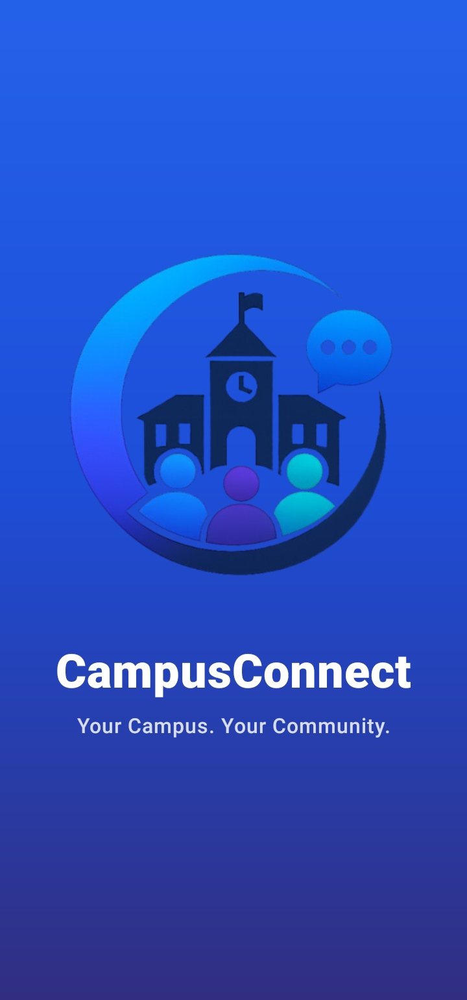 | 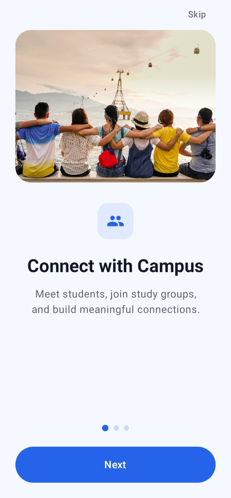 | 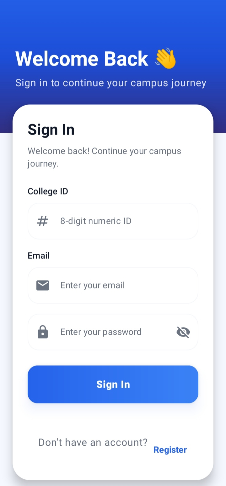 |

| Registration | Home | Profile |
|:------------:|:----:|:-------:|
| 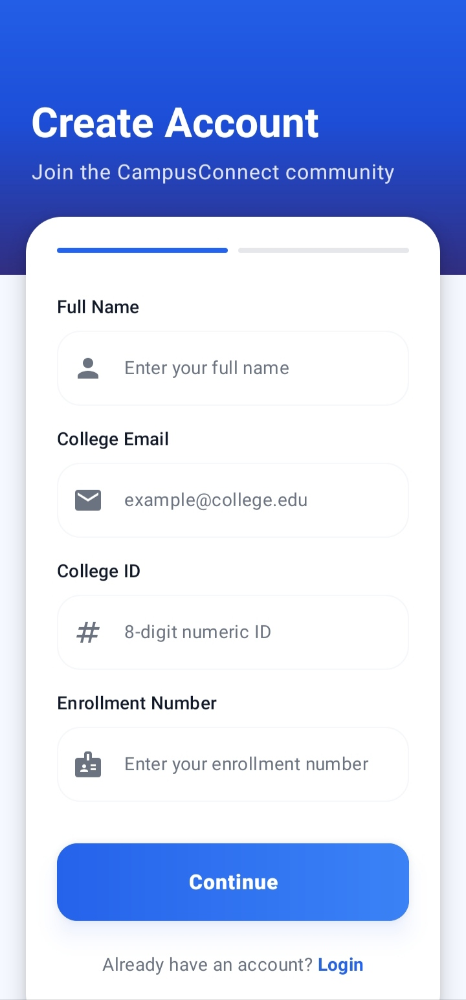 | 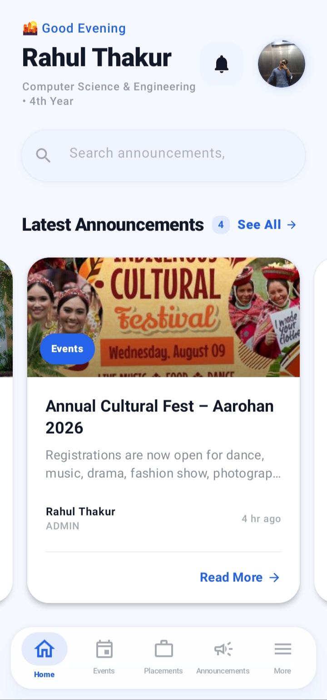 | 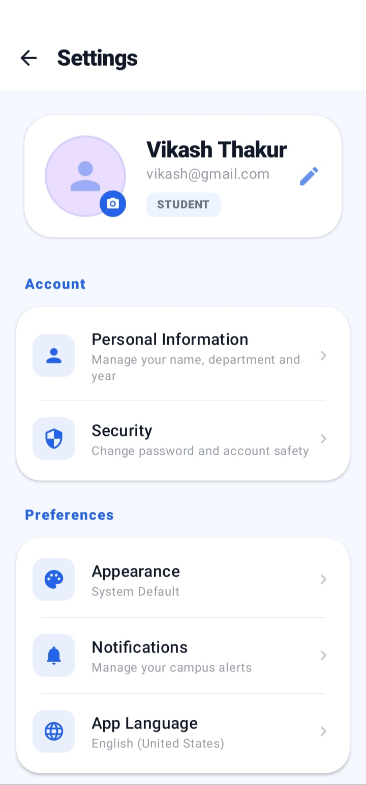 |

---

## 📚 Campus Modules

| Announcements | Placements | Events |
|:-------------:|:----------:|:------:|
| 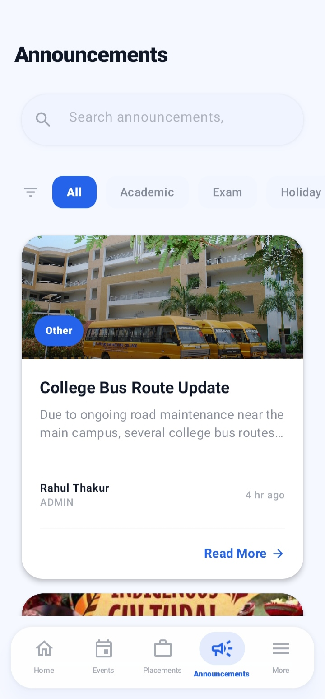 | 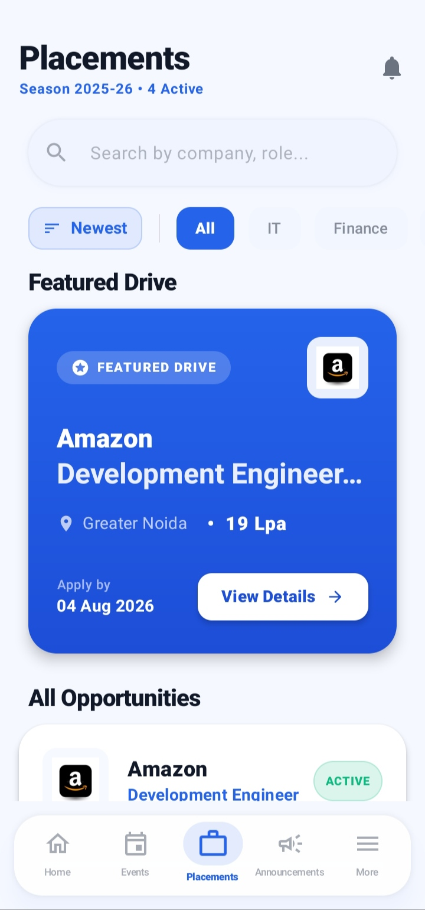 | 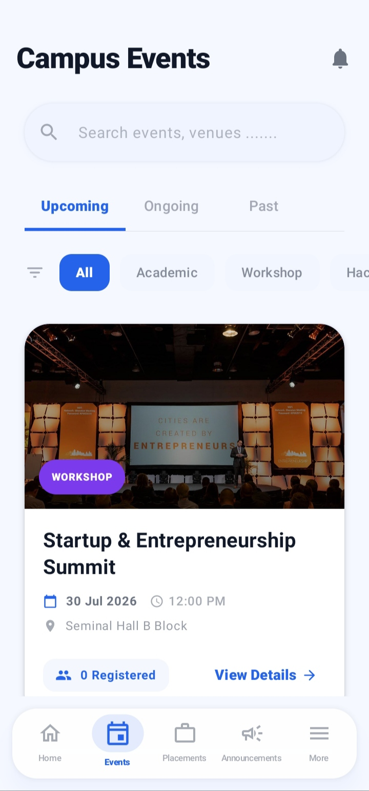 |

| Notes | Lost & Found | More |
|:-----:|:------------:|:----:|
| 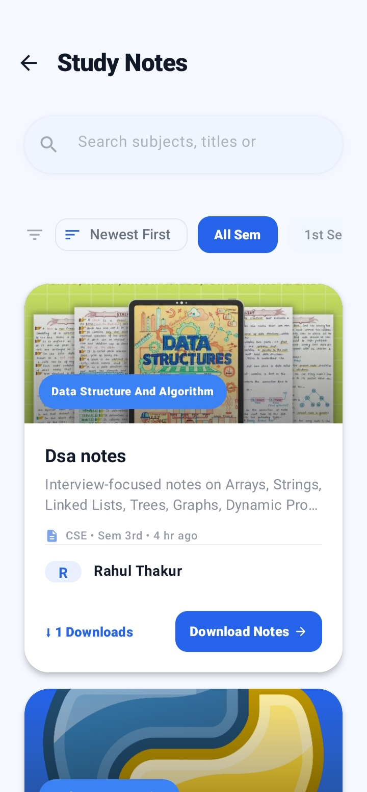 | 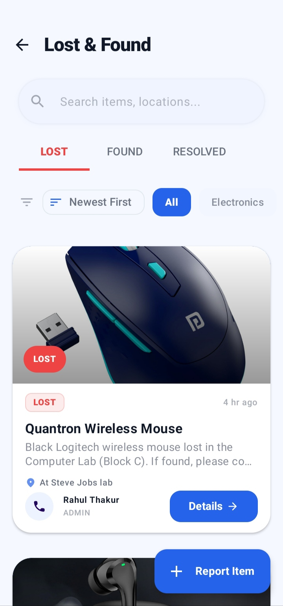 | 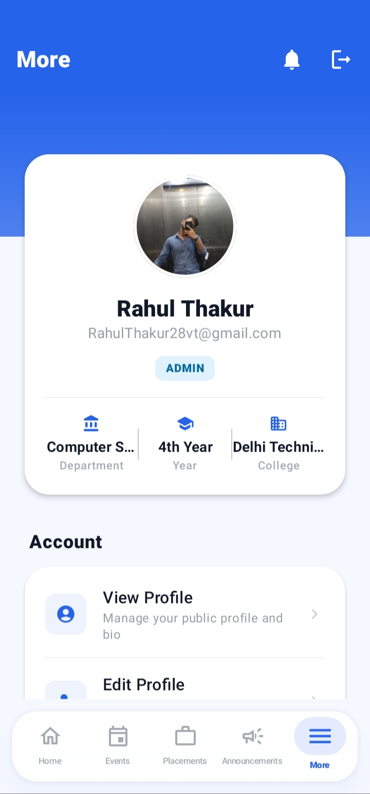 |

---

## ⚙️ Settings & Theme

| Settings | About | Dark Theme |
|:--------:|:-----:|:----------:|
| 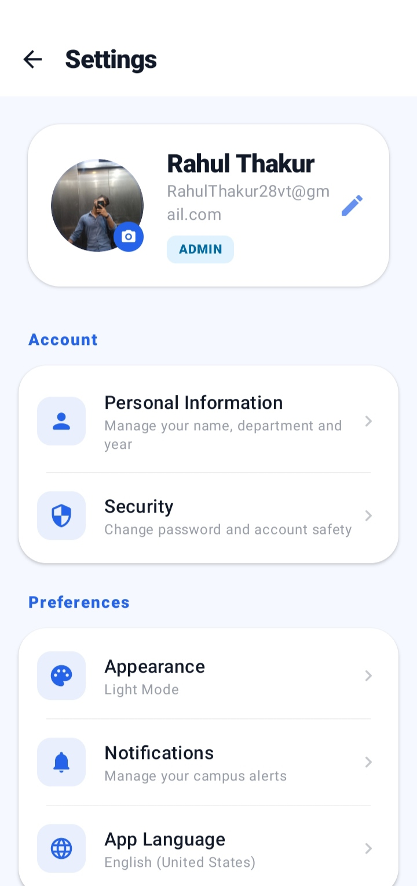 | 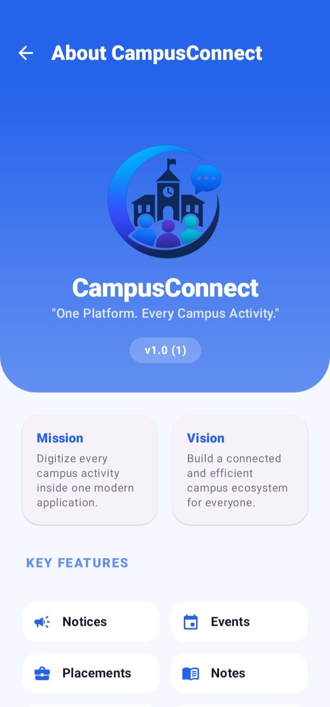 |  |

</div>


# 📥 Download APK

Want to try CampusConnect?

👉 **[Download the Latest APK](https://drive.google.com/drive/folders/1sgXCUkP7bvnpJKxfayX1Sx95xAPdJ7iV)**

> **Requirements**
> - Android 7.0 (API 24) or above
> - Allow installation from unknown sources if prompted


# ⚙️ Getting Started

## Clone Repository

```bash
git clone https://github.com/YOUR_USERNAME/CampusConnect.git
```

---

## Open Project

Open the project using **Android Studio Hedgehog or later**.

---

## Sync Gradle

Allow Gradle to download all required dependencies.

---

## Firebase Setup

1. Create a Firebase Project.
2. Enable Firebase Authentication.
3. Enable Cloud Firestore.
4. Download `google-services.json`.
5. Place it inside:

```
app/google-services.json
```

---

## Supabase Setup

Configure your Supabase Storage credentials inside the application before running.

---

## Run Application

Connect an Android device or emulator and click **Run ▶️**.

---

# 🔒 Security Features

- Firebase Authentication
- Email Verification
- Role-Based Access Control
- Secure Cloud Firestore Rules
- Session Persistence
- Input Validation
- Protected Administrative Operations

---

# 📈 Performance Highlights

- ⚡ Approximately 30–40% less UI boilerplate using Jetpack Compose.
- 🚀 Reactive UI powered by Kotlin StateFlow.
- ♻️ Reusable Compose components reduce duplicate code.
- 📱 Smooth Material 3 animations.
- 🧩 Modular architecture for easier maintenance.
- ☁️ Cloud-based backend using Firebase.
- 🔥 Efficient Firestore document-based data model.
- 🎨 Consistent Material Design implementation.

---

# 🌍 Scalability

CampusConnect is designed with a modular architecture that can be extended for deployments across multiple educational institutions.

The application's architecture allows future expansion with institution-specific data segregation, enabling support for independent colleges while sharing the same application infrastructure.

---

# 🚀 Future Roadmap

- 🤖 AI Resume Analyzer
- 🎤 AI Mock Interview Assistant
- 💬 Campus Chat
- 📅 Timetable Management
- 📊 Attendance Management
- 📈 Academic Performance Tracking
- 📌 Push Notifications
- 📹 Video Meeting Integration
- 📂 Assignment Submission
- 🏫 Full Multi-College Management
- 🌐 Admin Web Dashboard

---

# 🤝 Contributing

Contributions are always welcome.

If you have ideas for improvements, feature requests, or bug fixes, feel free to fork this repository and submit a Pull Request.

---

# 👨‍💻 Developer

## Rahul Thakur

Android Developer | Kotlin | Jetpack Compose | Firebase

GitHub:
https://github.com/RahulThakur-28

LinkedIn:

(https://www.linkedin.com/in/rahul-39440b30a/)

Email:

(RahulThakur28vt@gmail.com)

---


# ⭐ Support

If you found this project helpful,

please consider giving it a ⭐ on GitHub.

It motivates further development and helps others discover the project.

---

<div align="center">

## 🚀 Built with ❤️ using Kotlin, Jetpack Compose, Firebase & Modern Android Development

### ⭐ Star the repository if you like this project!

</div>
